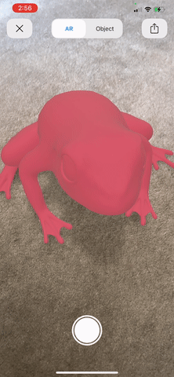

# Hola Frogger

#### What's new - Moved from storybording UI to 100% programmatic UI.

## About the project

Frogs are one of the most important species on earth. They play an important role in the food chain as both predators and prey, research, and many more.

Nowadays, the population of our tiny friends are being drastically declined due to global changes to air and water quality, and climate change. Alongside, humans are also the main reason for the decline of frog's count by using too many chemicals, not taking care or cleaning their gear while entering a frog's habitat or by not taking necessary precautions.

So, what happens when there are no frogs left?
No cure or treatment for diseases. No insect control - means files carrying malaria, zika, West Nile virus, dengue fever, Lyme disease, Encephalitis, leishmaniasis and etc.
Increased greenhouse emissions. Crumble in the food chain. Tadpoles keep the water clean. Less research and testing.

Hola Frogger solves a few of the issues and helps our tiny friends to live longer and save the planet.

   

 
 
 

## Promotional video
To watch the application promo, please click [here](https://www.youtube.com/watch?v=eiUdJElxNBA).

## Demo

 
Onboarding screen
  
  

Search/Explore frogs 
Dark and Light mode ready 
Showrtlist favourite frogs for later 

   

Hero feature, Identify frogs using ML 
Visit and sight the frogs to complete the challenges 
Get Alerts when entering frogs habitats 
Stay updated with latest news  

   

Project the frog 3d model in real world and interact with it
 *Hidden easter feature, you gotta find it to play with it* 

 

### Features -
1. Explore endangered/threatened frog species whereabouts like its image, scientific name, description, location, live weather details, frog count. 
2. Identify frog in realtime using the camera. Just point the camera at the frog and watch the magic
3. To make this learning fun, complete challenges to get an award. 
4. Get notified when entering a frog’s habitat to take precautions like sanitising yourself and equipment.
5. Stay updated to the latest news just filtered.
6. One last thing, find the easter feature hidden within the app. 
Let's see, if you can find it. ;p

Let's join the frog army and become a frogger. 
Save frogs = Helps save the environment, food, research, many more.

###	Technologies -
-	Alert feature, the user gets notified when entering a Frog's habitat. So, users can keep the frog's habitat and themselves safe and clean
-	Machine Learning feature, the user can identify the frog species along with the prediction percentage real-time using the built-in camera by leveraging on device in-house built models
-	Keeps the user engaged with weekly challenges and help them learn about frogs
-	Keeps user updated with the latest news using API. Adapts to Dark/Light mode.
-	The application was developed using several Apple frameworks like Core Data, Core Location, Map Kit, Web Kit, Vision, AR Kit, AV Foundation, Audio ToolBox and Quick Look and CocoaPods like Lottie, AwesomeSpotlightView, iOSDropDown

## Iteration 2 (Features) -
- Welcome Screen with animation.
- OnBoarding Screen a tour of application features, when the application is opened for the first time.
- Home Screen with Search feature. Helps your find specific Frog easily.
- New updated Frog list screen, with photos and their threatened status.
- Improved Map functionalities.
- All new Challenges screen.
- Shows challenges.
- Gives you statics of the achievements.

## Iteration 1 (Features) - 
- Frogs with threatened status.
- Get detailed information of each Frog.
- Can [favourite or unfavourite](https://youtu.be/KeNd2owf86I) a Frog to access later.
- Can see the Frogs location on Map.
- Get weather details of the frogs location, so that you can plan a visit accordingly for sighting.
- Notifying user when entering [Frog's habitat](https://youtu.be/pcqeEWCkYhM).
- Real-Time [identification](https://youtu.be/SkIn_CO-7fA) of Frogs using camera.
- Get [latest news](https://youtu.be/WPr21odGQsU) on 'Endangered Frogs' from trusted source with support of Web view.
- [Dark Mode/Light Mode](https://youtu.be/vhOirOOohlo) supported.
- Pleasing and simple UI.

## Requirements
- Swift 5.0
- iOS 12.0+ 
- To access Identification feature, please install the application on a physical device to access camera.
- Internet connection for loading Maps.

## Contact me
- If you like this project, please reachout to me at srvarma7@gmail.com and share your views.
